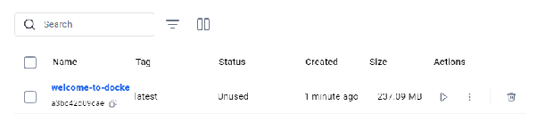

# DOCKER TUTORIAL

**by Agamjot Singh**

## Overview

[Docker in 100 Seconds](https://youtu.be/Gjnup-PuquQ)
The above is a basic overview of what docker is, what it can do and a very basic starter setup for docker.

**What is it?**
Docker is a tool used for developing, shipping and running applications. Its main use is to separate applications from your personal workspace so that you can deliver software quickly.

**How does it work?**

When you have a piece of software that you would like to package up, you can create a `DOCKERFILE`, build and publish it as a Docker container which can then be downloaded and ran on another device. Docker runs the application in an isolated environment called a container. A container is a bundled up piece of software that contains all the code and dependencies required for it to run. A container can be ran in Isolation, allowing you to you run many different containers simultaneously on the same machine.

**Why is it useful?**

Docker can be used for fast, consistent delivery of applications and is useful for CI/CD workflows, allowing developers to work in standardized environments. It often fixes the classic issue of "It works on my machine".

## **Docker Architecture**

**Docker Desktop** is a desktop application allowing users to use Docker with an application and interface.

**Docker daemon** (dockerd) listens for Docker API requests and manages Docker objects such as Images, containers, networks and volumes.

**Docker client** (docker) is the primary method of interaction with Docker.

When using docker, you create and use Images, containers, networks, volumes, plugins and other objects. Images are read-only templates with instructions for creating a Docker container. Images are derived from other Images with additional customizations. Containers are a runnable instance of an image.

## **Installation**

Docker can be installed from: [https://docs.docker.com/get-started/get-docker/](https://docs.docker.com/get-started/get-docker/)

1. Choose the version appropriate for your operating system and follow the installation instructions.
2. Docker Desktop launches on startup by default. If you do not want this functionality, you can disable it via the settings in the app.
3. Docker Desktop comes with a tutorial inside the app to get you started. This tutorial is also provided below, with some additional notes.

## Tutorial

1. Make sure Docker Desktop is running in the background, if you don’t you will get errors later on such as `daemon is not running`
2. In the terminal, navigate to folder where you would like to install the repository and execute the following command: *git clone [https://github.com/docker/welcome-to-docker](https://github.com/docker/welcome-to-docker)*
3. Move into the folder via: *cd welcome-to-docker*

   - Check that the Dockerfile was created (the cloned repo already has one, but personal projects will need to have one created for them)
   - The main componet of creating a docker container is creating a Dockerfile. The dockerfile is where you can specify important information such as the dependencies to download, terminal instructions and what ports to expose
   - More information is available below in **What makes up a Dockerfile**

   
4. Once you have created a Dockerfile (in this case one has been provided for you), an image can be built using the command: *docker build \-t welcome-to-docker .*

   - The \-t flag tags your image with a name. (welcome-to-docker in this case).
   - The  . lets Docker know where it can find the Dockerfile. (in this case the same directory you are currently in)


*The build docker image*

5. Once the build is complete, an image will appear in the Images tab. Select the image name to see its details.


*built container image in the image tab*


*details we see when clicking on the image name*

6. Select Run to run it as a container. In the Optional settings remember to specify a port number (something like 8089).


7. The application will be available at [http://localhost:/](http://localhost:8080/) where xxxx is the port number you specified (8089 in this case).


## What makes up a Dockerfile

- A dockerfile contains the instructions to build your docker image. The dockerfile structure contains “INSTRUCTION arguments”
- The dockerfile must begin with the FROM instruction used to specify a base image which is being built upon.
- Dockerfile reference contains more information about the architecture for dockerfile: [Dockerfile reference](https://docs.docker.com/reference/dockerfile/).

In the case of the tutorial, the purpose of each line is outlined below

```
# Start your image with a node base image
FROM node:18-alpine

# The /app directory should act as the main application directory
WORKDIR /app

# Copy the app package and package-lock.json file
COPY package*.json ./

# Copy local directories to the current local directory of our docker image (/app)
COPY ./src ./src
COPY ./public ./public

# Install node packages, install serve, build the app, and remove dependencies at the end
RUN npm install \
    && npm install -g serve \
    && npm run build \
    && rm -fr node_modules

# Expose port 3000. This is the port that the docker container will listen in and recieve requests from.
EXPOSE 3000

# Start the app using serve command
CMD [ "serve", "-s", "build" ]
```

## **Final Remarks**

Docker desktop will contain all your created containers and you can view information about them there.
The following are some webpages with more details about specific docker functionality and behaviour.

- [What&#39;s next | Docker Docs](https://docs.docker.com/get-started/introduction/whats-next/)
- [Get Started](https://docs.docker.com/get-started/)

## Troubleshooting 
If you come across any issues when attempting to work with docker files, please refer to these common docker issues.
1. Make sure your docker is running
2. Check you have available storage on docker desktop, if so you might need to delete some duplicate Images/containers
