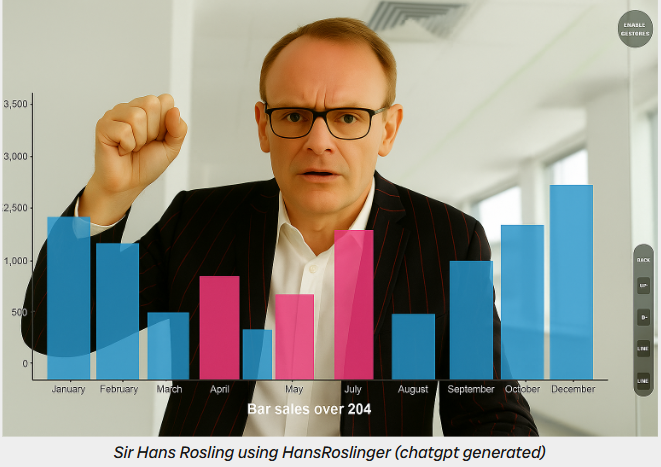
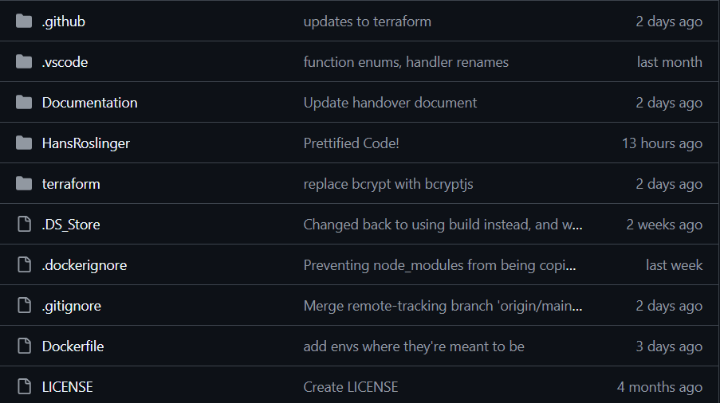
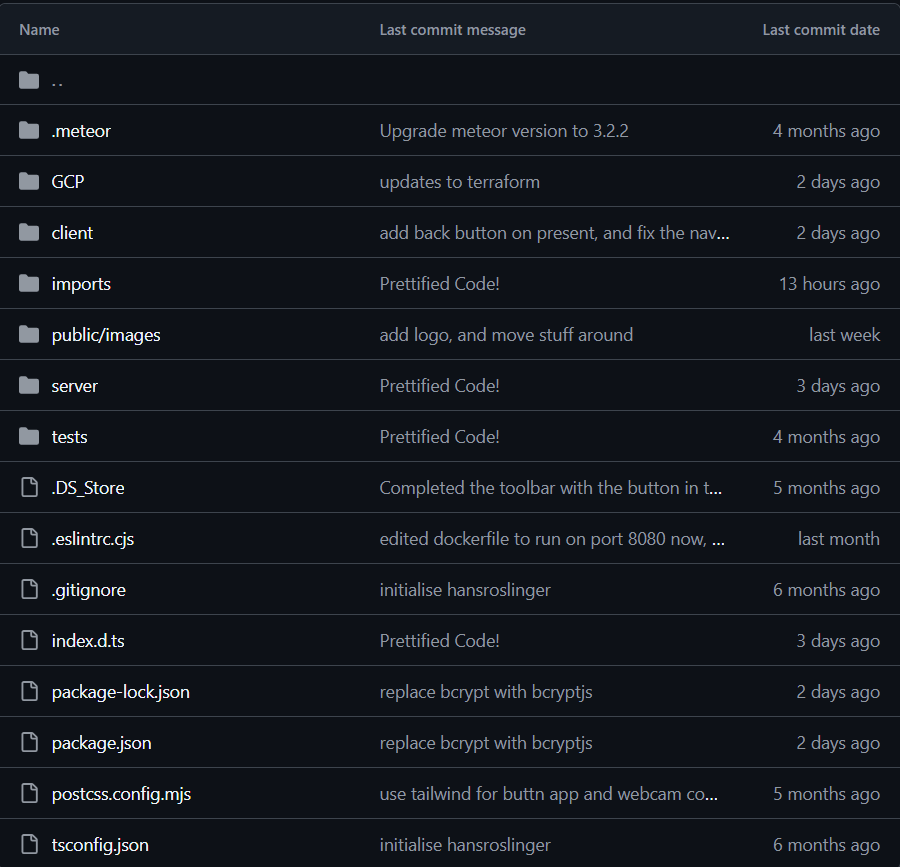
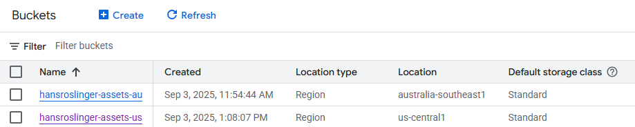
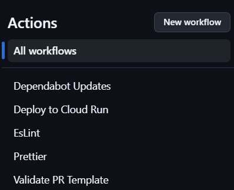
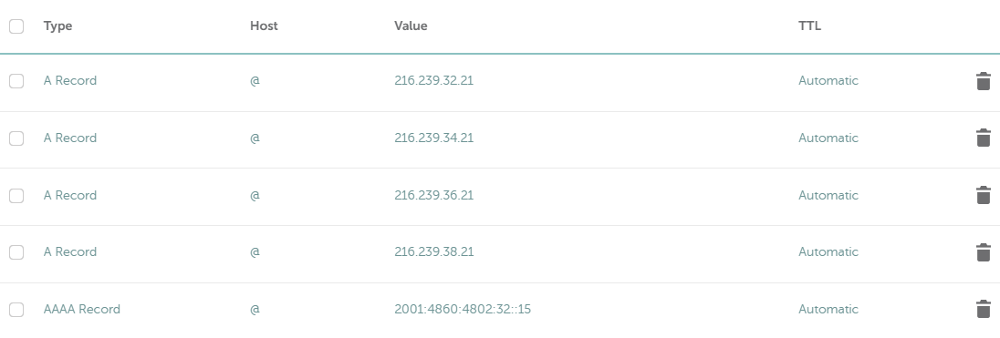
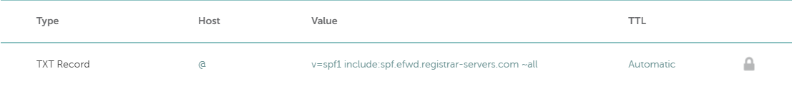

<p align="center">
  
</p>

<h1 align="center">HansRoslinger Handover Document</h1>

<h2 align="center">Milestone 4</h2>

<h3 align="center">
  Jiale Hu, Max Craig, Mayank Bajpai, Ranusha Liyanage, Shehara Hewawasam, Nathan Michailidis, Harkirat Singh, Tejeshvi Sagwal, Connor Macdougall, Liam Chui, Bhanu Wijekoon, Agamjot Singh
</h3>

<div style="page-break-before: always;"></div>

# Table of Contents

- [Purpose of this Document](#purpose-of-this-document)
- [What is HansRoslinger?](#what-is-hansroslinger)
- [Repository Structure](#repository-structure)
  - [HansRoslinger/ Structure](#hansroslinger-structure)
- [Installation Guides](#installation-guides)
- [Suggested Tutorials/Documentation](#suggested-tutorialsdocumentation)
- [Technology Stack](#technology-stack)
  - [Frontend Stack](#frontend-stack)
  - [Backend Stack](#backend-stack)
    - [MongoDB Database](#mongodb-database)
      - [In Code](#in-code)
      - [MongoDB Atlas](#mongodb-atlas)
    - [Google Cloud Bucket](#google-cloud-bucket)
  - [Github/CICD](#githubcicd)
- [How to Deployment to Production](#how-to-deployment-to-production)
  - [Routing to Unique Domain Name](#routing-to-unique-domain-name)
- [Versioning Strategy](#versioning-strategy)
- [Pull Request Strategy](#pull-request-strategy)
- [Troubleshooting](#troubleshooting)
  - [Incorrect Node Version](#incorrect-node-version)
  - [Module not found error](#module-not-found-error)
  - [Meteor stuck on `Extracting meteor-tool@1.4.0-1`](#meteor-stuck-on-extracting-meteor-tool140-1)

---

<div style="page-break-before: always;"></div>

# Purpose of this Document

The purpose of this document is to provide a comprehensive overview of the HansRoslinger application, allowing any future owners/contributors to understand the frontend and backend stack, as well as technologies we are utilising as well as how we are utilising them.

This document also contains further information on the installations required to begin working on HanRoslinger, basic application structuring, and common issues we've come across while developing this application, and how to troubleshoot them.

---

# What is HansRoslinger?

HansRoslinger is a gestured-based presentation tool that allows individuals to create, upload and present datasets and Images, with the unique ability of being able to present with their webcam positioned behind the data being presented, and being able to manipulate the data using built-in custom gestures.

The purpose of HansRoslinger is to make the process of presenting information as engaging as possible to the audience, and as intuitive as possible to the presenter. Bygone are the days of mindlessly clicking through a powerpoint presentation, with only your voice or a small video of you in the corner. HansRoslinger quite literally puts the presentation right in your fingertips.

<p align="center">
  
</p>

HansRoslinger is accessible via a public URL `hansroslinger.website`, or via the Cloud Run URL

`https://hans-roslinger-961228355326.us-central1.run.app`

Please note that the production version is currently deployed in the us-central1 zone, this is because only US regions support domain mapping, which allowed us to use the custom URL. Doing the same with an Australia based region is possible however would incur additional costs

---

<div style="page-break-before: always;"></div>

# Repository Structure

- **Documentation/** — Project docs (CI/CD, tutorials, troubleshooting) and supporting Images.
- **HansRoslinger/** — Meteor + React application source (client, server, shared imports, public assets, GCP helpers, tests).
- **terraform/** — Infrastructure as code for GCP (root configs, reusable module, per-env tfvars, state files).

<p align="center">
  
</p>

## HansRoslinger/ Structure

- **client/** — React/Meteor client entry and global HTML/CSS; bootstraps the UI.
- **server/** — Meteor server startup, methods, publications, and integrations.
- **imports/** — Shared app code: UI components/pages, handlers, gestures, and data layer.
- **public/** — Static assets served as-is (e.g., Images/HandoverDocumenticons).
- **GCP/** — Google Cloud helpers/config (e.g., bucket utilities).
- **tests/** — App tests and helpers.

<p align="center">
  
</p>

---

<div style="page-break-before: always;"></div>

# Installation Guides

Follow these steps in order to set up the required software for HansRoslinger

1. Install Meteor using the [following step](https://docs.meteor.com/about/install.html)
2. CD Into HansRoslinger directory and run `meteor npm install` to install all dependencies
3. [Install MongoSH](https://www.mongodb.com/docs/mongodb-shell/install/) in order to perform local development with MongoDB
4. [Install Gcloud CLI](https://cloud.google.com/sdk/docs/install) in order to perform testing with GCP
5. [Install Terraform](https://developer.hashicorp.com/terraform/tutorials/aws-get-started/install-cli) in order to provision cloud infrastructure

Once all of these steps have been followed to completion, you should be able to run the following commands to run HansRoslinger

```
# This will start hansroslinger
cd HansRoslinger
meteor

# in another terminal, you can access the local MongoDB Database using the following
cd HansRoslinger
meteor mongo

# in another terminal, you can access information about the data stored on gcloud with the following command
gcloud --help
# or you access it via the Google Cloud Console
https://console.cloud.google.com/welcome?invt=Ab6sAg&project=hansroslinger-468011

```

---

<div style="page-break-before: always;"></div>

# Suggested Tutorials/Documentation

If you are not familiar with the services above, feel free to take a look at the following documentation/tutorials to gain some familiarity with these services.

**Meteor**

- [Technical Tutorial Plan](/Documentation/Technology%20Tutorial%20Plan.md)
- [Introduction to Meteor](https://guide.meteor.com/)

**MongoSH**

- [Introduction to MongoDB](https://www.mongodb.com/docs/manual/introduction/)
- [Introduction to MongoDB Atlas](https://www.mongodb.com/docs/atlas/)

**Google Cloud Services**

- [Google Cloud Overview](https://cloud.google.com/docs/overview)
- [Cloud Run Overview](https://cloud.google.com/run/docs)
- [Artifact Registry Overview](https://cloud.google.com/artifact-registry/docs)
- [Storage Bucket Overview](https://cloud.google.com/storage/docs)

**Terraform**

- [What is Terraform](https://developer.hashicorp.com/terraform/intro)
- [Getting started with Terraform](https://developer.hashicorp.com/terraform/tutorials/gcp-get-started)

---

<div style="page-break-before: always;"></div>

# Technology Stack

HansRoslinger has been primariliy developed using the meteor full stack framework, which combines a number of different front end and back end frameworks to deliver an end to end web application.

## Frontend Stack

HansRoslinger makes use of the React library in combination with Material UI (MUI) for the definition and use of UI component.

More information can be found about React [here](https://react.dev/).
More information can be found about Material UI [here](https://mui.com/).

Each webpage is split into it's own React file in the [UI directory](https://github.com/Monash-FIT3170/2025W1-HansRoslinger/blob/44657d55f1336b433a2eb149f717eb1472976520/HansRoslinger/imports/ui), with additional handling logic and components contained within subdirectorys in the same location.

## Backend Stack

All of the backend logic written for HansRoslinger is contained within the Meteor application in the form of TypeScript. TypeScript provides the benefit of strong in-time type hinting, which has improved troubleshooting as we developed this software.

More Information can be found about typescript [here](https://www.typescriptlang.org/).

### MongoDB Database

#### In Code

All persistent data for HansRoslinger (excluding user authentication information such as JWT which is stored in cookies) is stored in a NoSQL MongoDB database.

MongoDB Collections are defined directly in Meteor, [example](https://github.com/Monash-FIT3170/2025W1-HansRoslinger/blob/1f1a180703a791b4bee73e65a5fc6f0f034dd272/HansRoslinger/imports/api/database/dataset/dataset.ts).

They are then published on start up of the server component of Meteor, [example](https://github.com/Monash-FIT3170/2025W1-HansRoslinger/blob/main/HansRoslinger/server/main.ts#L7-L9)

And subsribed to directly in the client side backend logic in order to upload and retrieve documents from, [example](https://github.com/Monash-FIT3170/2025W1-HansRoslinger/blob/1f1a180703a791b4bee73e65a5fc6f0f034dd272/HansRoslinger/imports/ui/App.tsx#L10-L12)

#### MongoDB Atlas

MongoDB Atlas is used to host our database online, With the free tier allowing us to store 512MB worth of documents

- If you expect more space being required in the future you may need to look into payed plans, or enterprise systems

More information about MongoDB [here](https://www.mongodb.com/).

In order to connect to MongoDB Atlas we make use of a connection URL which specifies a path to our database, as well as sensitive login information for the account. This is stored via a Github Secret.

You can look into how this MongoDB Atlas database is connected to meteor through this guide [here](https://docs.meteor.com/api/collections.html#mongo_url).

### Google Cloud Bucket

All Images uploaded by the user to HansRoslinger is stored in a google cloud bucket. Buckets allows for cheap and robust uploading of Images, witih links to the files being stored as documents in the MongoDB Database.

The buckets are available [here](https://console.cloud.google.com/storage/browser?referrer=search&invt=Ab6sAg&project=hansroslinger-468011&prefix=&forceOnBucketsSortingFiltering=true&bucketType=live)



## Github/CICD

We utilise Github in to track developmnet, as well as to store documentation and run CICD workflows.

Documentation is found in this [directory](https://github.com/Monash-FIT3170/2025W1-HansRoslinger/tree/main/Documentation)

CICD Workflows are found under [.github](https://github.com/Monash-FIT3170/2025W1-HansRoslinger/tree/main/.github) and involve the following

- [eslint ](https://github.com/Monash-FIT3170/2025W1-HansRoslinger/blob/main/.github/workflows/eslint.yaml)which validates syntax for TypeScript and React (.tsx) files
- [prettier ](https://github.com/Monash-FIT3170/2025W1-HansRoslinger/blob/main/.github/workflows/prettier.yaml)which provides auto-linting when a PR is merged to main
- [deploy ](https://github.com/Monash-FIT3170/2025W1-HansRoslinger/blob/main/.github/workflows/deploy.yaml)which deploys the Meteor application to CloudRun, more information is available in the #Deployment section

We also have configured a [pull request template](https://github.com/Monash-FIT3170/2025W1-HansRoslinger/blob/main/.github/pull_request_template.md) in order to standardise the process of creating a pull request

<p align="center">
  
</p>

---

<div style="page-break-before: always;"></div>

# How to Deployment to Production

Our application is deployed using Google Cloud Services in the form of a Cloud Run using request based billing. This reduces cost as you only pay for the time to fufill each request, and not the continuous deployment of the application., with the following steps being followed in order to deploy the application.

1. A DockerFile specifies the instructions to build the application into a container
2. A github workflow has been created which can be manually triggered (however this can be automated if needed) to deploy to GCP.

The steps executed to the pipeline are the following

1. Authenticate to the HansRoslinger GCP Project
2. Build the Docker Image and publish it to Google Artifact Registry
3. Deploy a CloudRun application using the provided Google Artifact Registry Image

If deployed successfully the HansRoslinger application should be accessible via this URL

`https://hans-roslinger-961228355326.australia-southeast1.run.app/`

Information about [CloudRun](https://cloud.google.com/run?utm_source=PMAX&utm_medium=PMAX&utm_campaign=17100102-GCP-DR-APAC-ROA-en-PMAX-Prospecting-Display-SMB-GCP-ROA-Cloud_Run_EN&utm_content=c--x--9071432-17821954699&utm_term&gclsrc=aw.ds&&https://ad.doubleclick.net/ddm/trackclk/N5295.276639.GOOGLEADWORDS/B26943865.344329733;dc_trk_aid=535895606;dc_trk_cid%3D163098484;dc_lat%3D;dc_rdid%3D;tag_for_child_directed_treatment%3D;tfua%3D;ltd%3D&gad_source=1&gad_campaignid=17820972903&gclid=CjwKCAjwq9rFBhAIEiwAGVAZPzh1QFUIBTXTJNXZ324pYswHNPOGV5jsSKVZKfENyVf_EN-bdCPqLxoCKsIQAvD_BwE&hl=en)
Information about [request-based billing](https://cloud.google.com/run/docs/configuring/billing-settings)

### Routing to Unique Domain Name

The HansRoslinger team has purchased the domain `hansroslinger.website` from [namecheap.com](https://www.namecheap.com/)

Because we are primarily hosting our services in Google Cloud, and this provider differs from where we had purchased the domain from, we have to perform some additional steps in order to set up routing between our domain name and our Cloud Run deployment

1. [setup name servers in name cheap to point to google domain services](https://www.namecheap.com/support/knowledgebase/article.aspx/9434/10/using-default-nameservers-vs-hosting-nameservers/)
2. authenticate that you own the said domain in [google domain services
   ](https://cloud.google.com/identity/docs/verify-domain)- Once you have authenticated that you own the domain, you are able to control all future routing from Google Domain Services
3. Update domain specifications in google so that the domain points to the Cloud Run service
4. You will then need to set up A, AAAA and TXT DNS Records to point to your Cloud Run Service. While a Cloud Run is deployed to a region, this can have multiple zones, so you may need to configure multiple A DNS Records (4 in this case)

**Purpose of DNS Records**

> **A record:** Maps our domain name to the Google Server Zone IPv4 addresses.
> **AAAA record:** Maps our domain name to the Google Server IPv6 address.
> **TXT record:** Stores google site verification

<p align="center">
  
</p>

<p align="center"><i>A and AAAA Records</i></p>

<br>
<br>

<p align="center">
  
</p>
<p align="center"><i>TXT Records Records</i></p>

Once this has been configured, google will automatically generate a SSL/TLS certificate to encrypt your domain, and shortly after you should be able to access your Cloud Run from your website.

---

<div style="page-break-before: always;"></div>

# Versioning Strategy

Through the development of HansRoslinger we have not considered a versioning strategy, with our repository only consisting of tags to signify the completion of some milestones. However, in order to maintain the integrity of the code, we suggest you do the following. Information regarding semantic versioning was taken from this source https://semver.org/.

1. Follow `MAJOR.MINOR.PATCH`, versioning. In order to maintain consistency, each pull request should have a label that is added by the user in order to signify whether the added feature is a PATCH, MINOR, or MAJOR change.
2. Once the pull request has been merged, the appropriate tag should be generated (this can be done manually or automatically via a workflow) to increment the appropriate place in the version in line with the pull request label.
3. It is up to your discretion as to whether you would like each version to be deployed to production, or if you would like only major/semi regular deployments to be completed.

---


# Pull Request Strategy

We have followed the provided pull request strategy throughout our development of HansRoslinger, and we suggest you do the same, making modifications if neccessary.

1. A pull request is required to fill out the template with all required information. https://github.com/Monash-FIT3170/2025W1-HansRoslinger/blob/main/.github/pull_request_template.md
2. Branch name must abide by the quality assurance plan, and the title must be a description of the additional features added.
3. Each pull request should mark an indvidiual feature or set of related features.
4. The pull request must pass all CI/CD workflows.
5. The pull request must have at least 1 approval in order to be merged.


---

<div style="page-break-before: always;"></div>

# Troubleshooting

While meteor is a comprehensive full stack framework, we have experienced countless issues with long build times, package issues, and modules not being found.

The following is a list of common issues that we encountered while developing HansRoslinger and how we fixed them.

## Incorrect Node Version

Make sure you've downloaded the latest version of node as react-router requires at least `>=20.0.0`. Run `node -v` to check your version, if it is too low, uninstall node and then install from this website [https://nodejs.org/en/download](vscode-file://vscode-app/c:/Users/maxcr/AppData/Local/Programs/Microsoft%20VS%20Code/resources/app/out/vs/code/electron-browser/workbench/workbench.html).

## Module not found error

If a module not found error occurs when you are trying to run meteor, even after you have

- Validated that the import path is correct
- Validated that the data you are importing is being exported from the file

If you delete the `package-lock.json` file and then run `meteor npm install` from the `HansRoslinger` directory that should fix the issue

## Meteor stuck on `Extracting meteor-tool@1.4.0-1`

This issue can cause meteor to spend sometimes multiple hours extracting tools, and sometimes even then it doesn't work.

[This Github Issue describes the fix](https://github.com/meteor/meteor/issues/7688#issuecomment-360987929)

1. Update git
2. run `npx meteor uninstall`, `npm uninstall -g meteor` or `choco uninstall meteor` depending on how you initially downloaded meteor
3. check that the `%appdata%/Local/.meteor` folder is removed (press Windows Key + R and type `%appdata%` to get to this directory)
4. remove the `HansRoslinger/.meteor/local` directory
5. remove the versions-file in `HansRoslinger/.meteor`
6. remove the `HansRoslinger/node_modules` directory
7. run `npx meteor install`, `npm install -g meteor --foreground-script` or `choco install meteor` depending on how you initially downloaded meteor
8. in the `HansRoslinger` folder, run meteor npm install
9. in the `HansRoslinger` folder, run meteor
10. This should hopefully have fixed the issue
