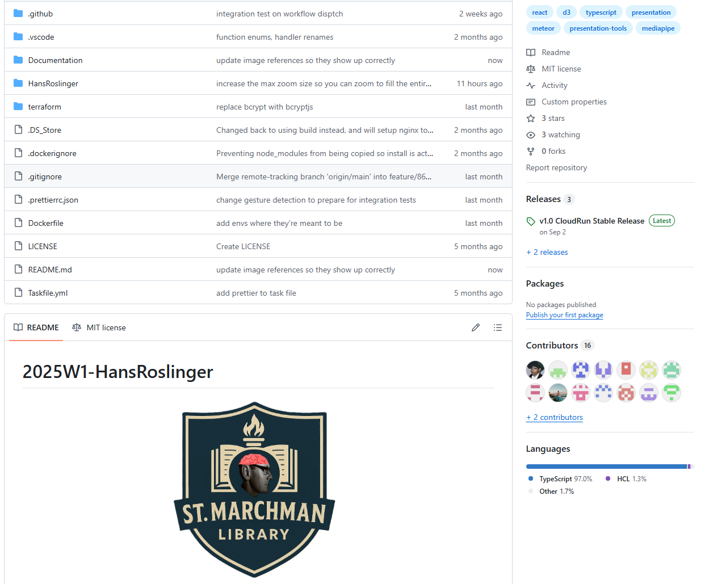
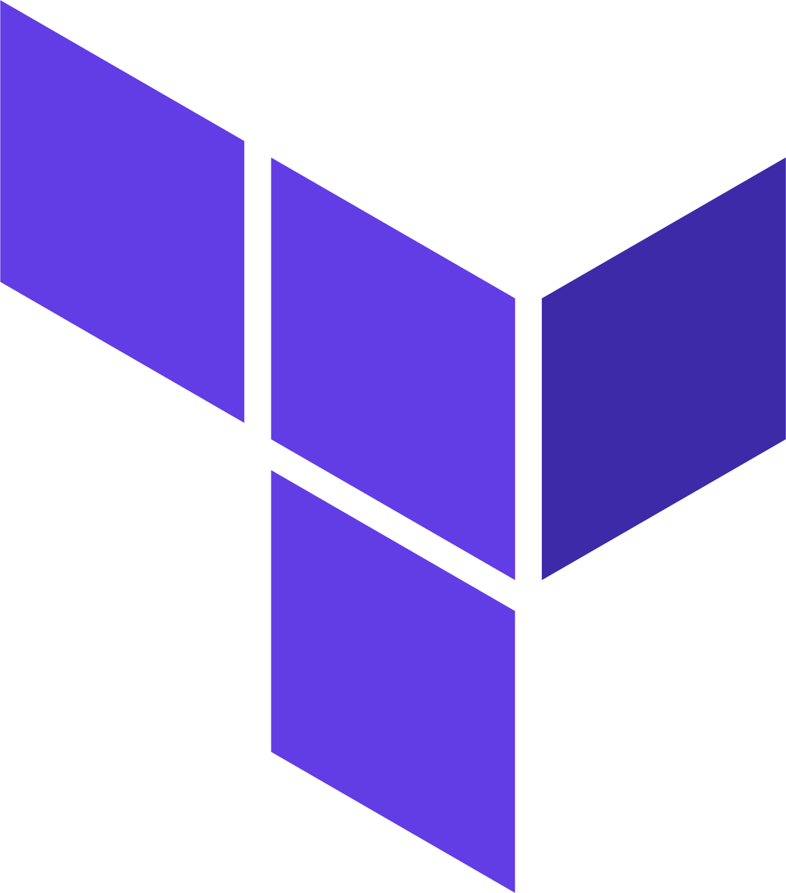

  

<h1 align="center">HansRoslinger Maintenance Plan</h1>

<h2 align="center">Milestone 4</h2>

<h3 align="center">
  Jiale Hu, Max Craig, Mayank Bajpai, Ranusha Liyanage, Shehara Hewawasam, Nathan Michailidis, Harkirat Singh, Tejeshvi Sagwal, Connor Macdougall, Liam Chui, Bhanu Wijekoon, Agamjot Singh
</h3>

 
 

# Aim

The aim of this document is to outline the winding down of HanRoslinger, including

* Steps taken to maintain the current state of the code
* The state of the production system
* Associated Costs with running HansRoslinger into the future
* Additional Comments

# What is HansRoslinger?

HansRoslinger is a gestured-based presentation tool that allows individuals to create, upload and present datasets and Images, with the unique ability of being able to present with their webcam positioned behind the data being presented, and being able to manipulate the data using built-in custom gestures.

The purpose of HansRoslinger is to make the process of presenting information as engaging as possible to the audience, and as intuitive as possible to the presenter. Bygone are the days of mindlessly clicking through a powerpoint presentation, with only your voice or a small video of you in the corner. HansRoslinger quite literally puts the presentation right in your fingertips.

  

HansRoslinger is accessible via a public URL `hansroslinger.website`, or via the Cloud Run URL

`https://hans-roslinger-961228355326.us-central1.run.app`

Please note that the production version is currently deployed in the us-central1 zone, this is because only US regions support domain mapping, which allowed us to use the custom URL. Doing the same with an Australia based region is possible however would incur additional costs

# Maintaining the current state of the codebase

  
   
  <em>Repository Homepage</em>

All features of HansRoslinger, including

1. Application code
2. Infrastructure via Terraform
3. Documentation

Are maintained through the github repository `https://github.com/Monash-FIT3170/2025W1-HansRoslinger`. This repository is owned by the [Monash FIT3170 Github Organisation](https://github.com/Monash-FIT3170), therefore the biggest risk to the integrity of our codebase is whether the maintainers of the repository retain it. Therefore the first steps in maintaining the system is to ensure with the owners of the organisation that the repository will remain following the completion of the unit.

In the event that the repository will not be kept, a fork of the repository can be made with minimal loss in information. The only information not retained is

1. Issues and Pull Requests (This will be mitigated by closing, merging or transferring over to the forked repository)
2. Branch protection rules and CI/CD settings (this is minimal within the repository and can be manually transferred over or configured as desired by the new owner)

# State of the production system

## Google Cloud Platform

  

The production version of HansRoslinger, defined as the CloudRun deployment accessible by the domain `hansroslinger.website` is deployed entirely using the Google Cloud Platform, which is owned by `Mayank Bajpai`, with partial permissions provided to

- Maximilian Craig
- Tejeshvi Sagwal
- Liam Chui

In order to manage [CloudRun deployments](https://cloud.google.com/run?hl=en), [Google Buckets](https://docs.cloud.google.com/storage/docs/buckets), and [Artifact Registry Images](https://cloud.google.com/artifact-registry/docs).

### Expectation following the conclusion of the unit

It is not expected that Mayank will continue to maintain the Google Cloud Project, as doing so incurs costs associated with storing Images in the bucket, and handling CloudRun instances. Therefore an alternative solution needs to be put in place in order to provide the opportunity for a new party to inherit and manage the Google Cloud Project and it's associated services.

### Terraform Infrastructure

  

Throughout the development of HansRoslinger, all required Google Cloud infrastructure has been provisioned and deployed via Terraform. [More information regarding terraform can be found here](https://developer.hashicorp.com/terraform/intro).

In the event that Mayank is no longer able to host the HansRoslinger services via GCP, a new party can easier provision the required infrastructure by following these steps

1. Update the `project_id` in `np.tfvars` to the new desired project, [source](https://github.com/Monash-FIT3170/2025W1-HansRoslinger/blob/main/terraform/tfvars/np.tfvars#L1). This relates to infrastructure used for local development and testing.
2. Update the `project_id` in `prod.tfvars` to the new desired project, [source](https://github.com/Monash-FIT3170/2025W1-HansRoslinger/blob/main/terraform/tfvars/prod.tfvars). This relates to infrastructure used for production environments
3. Update the `project_id` found within the `bucket.ts` in the HansRoslinger application, [source](https://github.com/Monash-FIT3170/2025W1-HansRoslinger/blob/main/HansRoslinger/GCP/bucket.ts#L3). This used by the application to source the correct project to push Images to
4. Update `GCLOUD_PROJECT_ID` in action secrets, [source](https://github.com/Monash-FIT3170/2025W1-HansRoslinger/settings/secrets/actions). This is utilised by the workflows that deploy our production CloudRun.
5. Update the `GCP_SA_KEY` in action secrets, [source](https://github.com/Monash-FIT3170/2025W1-HansRoslinger/settings/secrets/actions). This is utilised by the workflow in order to authenticate the SA to deploy the CloudRun services. Information on creating a service account key can be found [here](https://cloud.google.com/iam/docs/keys-create-delete)

Assuming that all other service names remain the same (this is a valid configuration, with the naming only being changed at the discretion of the new user), all GCP services should function after following these steps

## Mongo Atlas Database

  

HansRoslingers production environments make use of a `Mongo Atlas Database` in order to store all the required user metadata. This is owned by Mayank, with permissions granted to Maximilian Craig to view and manage resources within the database.

In the event that Mayank is no longer able to host the Mongo Atlas Database, the following steps can be followed in order to replace the service

1. Create a MongoDB Atlas Database [from this page](https://www.mongodb.com/products/platform/atlas-database).
2. Once created, obtain the `MONGO_URL`, and update the value in the action secrets, [source](https://github.com/Monash-FIT3170/2025W1-HansRoslinger/settings/secrets/actions). This is used by the production CloudRun in order to upload and retrieve user information.

Assuming these steps are followed, the production environment should be able to successfully upload and retrieve metadata from the MongoDB Database.

## hansroslinger.website Domain

There are currently 2 ways to access the production deployment of CloudRun

* Through the automatically generated CloudRun URL `https://hans-roslinger-961228355326.us-central1.run.app`
* Through the custom domain `https://hansroslinger.website/`

The CloudRun URL is persistent as long as the CloudRun is deployed via the [Github Actions](https://github.com/Monash-FIT3170/2025W1-HansRoslinger/blob/main/.github/workflows/deploy.yaml), however the custom domain is an ongoing subscription. The current lease period for the domain is 1 year, in order to maintain the domain after this, it will need to be renewed via [namecheap.com](namecheap.com).

# Associated Costs

Because our production deployment is hosted on a combination of Google Cloud and MongoDB Atlas, there are associated costs with maintaining a production environment depending on

- The number of users
- The expected availability of the service

Below I have outlined each service which is in use by our production deployment, the cost per unit, and the accumulated cost as we have developed HansRoslinger

## Google Cloud Platform

| Service           | Cost per unit                                                                                                                                                                                 | Accumulated Cost Given Current Use                                                           |
| ----------------- | --------------------------------------------------------------------------------------------------------------------------------------------------------------------------------------------- | -------------------------------------------------------------------------------------------- |
| Cloud Run         | **Free Tier** CPU: 240,000 vCPU-seconds free per month RAM: 450,000 GiB-seconds free per month  CPU: $0.000033 per vCPU-second RAM: \$0.0000037 per GiB-second | $0 - We have managed to stay within the free tier whilst development HansRoslinger      |
| Storage Bucket    | **No Free Tier**\$0.023 per GB per Month                                                                                                                                                | $0.00023 as of the end of the semester as we are currently are storing 9MB of user data |
| Artifact Registry | **Free Tier** Up to 0.5GB  $0.10 per GB / Month                                                                                                                          | \$0 as we have not exceeded the 0.5GB free tier                                              |
| Custom Domain     | $1.99 First year cost  \$14.99 Per Year otherw                                                                                                                                      | \$1.99 for the initial purchasing cost                                                       |

## MongoDB Atlas

| Service     | Cost per Unit                                                                                                                  | Accumulated Cost Given Current Use              |
| ----------- | ------------------------------------------------------------------------------------------------------------------------------ | ----------------------------------------------- |
| Mongo Atlas | **Free Tier** $0 per hour for up to 512MB  \$0.011 per hour for up to 5GB \$0.08 per hour up to 10GB | \$0 as we have not exceeded the 512MB free tier |

## Custom Domain

| Service                                    | Cost per Unit                                                   | Accumulated Cost Given Current Use               |
| ------------------------------------------ | --------------------------------------------------------------- | ------------------------------------------------ |
| hansroslinger.website domain via NameCheap | $2.99 for the first year  \$13.99 each following year | $2.99 for the first year ownership of the domain |

# Additional Comments

Throughout the development of HansRoslinger we have experienced increasing amounts of trouble using the Meteor stack. These include but are not limited to:
- Errors loading packages
- Errors downloading packages
- Loading times between 1 minute and over an hour
- Meteor not being recongised entirely
- Meteor not able to be updated using `meteor update`
- Difficulty deploying using conventional Dockerisation

For this reason, if this software is to be maintained into the future, it is highly recommended that whoever owns this project makes it their highest priority to migrate the application to an alternative framework such as `Vite`. The main reason we initially utilised Meteor was due to it being recommended to us, however the only unique feature we have used is the built in local MongoDB Database, which can be easily replicated in Vite and without all the difficulties outlined above.

This will allow for a much more straight forward developer experience, and potential issues with scalability into the future