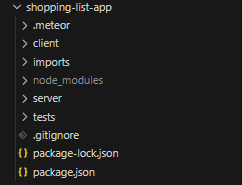
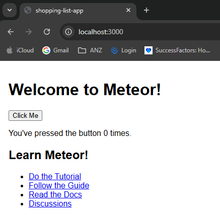

# Technology Tutorial Plan
**Prepared by Max Craig**


# Preface
This Technology Tutorial Plan will follow the creation of a small application that teaches
- Setting up a meteor.js application
- Using react to create components
- Basic javascript/Library usage
- MongoDB usage
Each tutorial will build upon what was done previously, so they should be completed in order


For this tutorial, we’re going to setup a basic shopping list application, it will have an interface with the following features
- Input fields to enter item and quantity
- Button to submit item to shopping list
- Field to view all items currently in the shopping list
- Items in the shopping list will be stored in a MongoDB database

# 1. Installing Meteor.js
To install meteor.js, you can follow the steps outlined [here](https://docs.meteor.com/about/install).

In general, run the following command
```
npx meteor
```

If this does not work, try running the following command instead
```
npm install -g meteor --foreground-script
```

# 2. Setting up a Meteor.js application
> Information has been gather from this meteor tutorial: [creating the app](https://react-tutorial.meteor.com/simple-todos/01-creating-app.html)

Begin by choosing a directory where you would to create your meteor application, and then running the following command
```
meteor create shopping-list-app --prototype
```
> NOTE: [--prototype](https://docs.meteor.com/cli/#prototype) is an argument to allow changing of collections quickly, and should not be used on an actual production ready application, please omit when doing actual projects

When finished, the following directories and files should be create



run `cd shopping-list-app` and then `meteor run` to begin your application

```
C:\Git Repos\2025W1-HansRoslinger\shopping-list-app>meteor run
[[[[[ C:\Git Repos\2025W1-HansRoslinger\shopping-list-app ]]]]]

=> Started proxy.
=> Started HMR server.
=> Started MongoDB.
I20250325-18:30:30.354(11)? ** You've set up some data subscriptions with Meteor.publish(), but
I20250325-18:30:30.501(11)? ** you still have autopublish turned on. Because autopublish is still
I20250325-18:30:30.501(11)? ** on, your Meteor.publish() calls won't have much effect. All data        
I20250325-18:30:30.502(11)? ** will still be sent to all clients.
I20250325-18:30:30.503(11)? **
I20250325-18:30:30.503(11)? ** Turn off autopublish by removing the autopublish package:
I20250325-18:30:30.504(11)? **
I20250325-18:30:30.505(11)? **   $ meteor remove autopublish
I20250325-18:30:30.505(11)? **
I20250325-18:30:30.506(11)? ** .. and make sure you have Meteor.publish() and Meteor.subscribe() calls 
I20250325-18:30:30.507(11)? ** for each collection that you want clients to see.
I20250325-18:30:30.508(11)?
=> Started your app.

=> App running at: http://localhost:3000/
   Type Control-C twice to stop.
```
*This should create a local hosted server where you can access your application*
> NOTE: as you change your code the web server will change **LIVE**, this makes development very easy as the modifications as instantly seen

> ANOTHER NOTE: the terminal where you run your meteor app has to stay open for the live server to be accessible, create another terminal to do other commands



# 3. How does React work in meteor.js?

In the case of meteor.js, all React UI Components are stored in the `imports/ui` directory.

```
├───api
│       links.js
│
└───ui
        App.jsx
        Hello.jsx
        Info.jsx
```

Each individual part of the UI is written in a `.jsx` react file, and they are all imported and combined together in the `App.jsx` file

```jsx
import React from 'react';
import { Hello } from './Hello.jsx'; //Importing the Hello component from Hello.jsx
import { Info } from './Info.jsx'; //Importing the Info component from Info.jsx

export const App = () => (
  <div>
    <h1>Welcome to Meteor!</h1> //Here we can define html code
    <Hello/>  // We can also add imported components so they are included in the application
    <Info/>
  </div>
);
```

> EXERCISE: take a look at the `Hello.jsx` and `Info.jsx` files and see what they do!


### How is the App.jsx then ran by the server?
in the `client` directory there contains 3 files. This is the top level html file which is ran when the server is created
- It's html!

```
├───client
    main.css
    main.html
    main.jsx
```

The `main.html` file creates a div (a block) in html which references an object with the id `react-target`
```html
<head> <<>>
  <title>shopping-list-app</title>
  <meta name="viewport" content="width=device-width, initial-scale=1.0">
</head>

<body>
  <div id="react-target"></div>   <!-- A div is created that specifies the react-target component -->
</body>

```

the `main.jsx` imports the App.jsx as a react components, creates a component with the react-target that is specifies, and tells the container to render the react code from the App component
```jsx
// main.jsx
import React from 'react';
import { createRoot } from 'react-dom/client';
import { Meteor } from 'meteor/meteor';
import { App } from '/imports/ui/App'; //Here the main App component is imported

Meteor.startup(() => {
  const container = document.getElementById('react-target');
  const root = createRoot(container);
  root.render(<App />);
});

```

# 4. Creating Shopping list React Components 
Now that we know the structure of react components in meteor.js, let's try and create 2 UI components
- A set of Input fields where we can add items to our shopping list
- A text box where we can see all the items in our shopping list

> NOTE: the key to react components is to create ones that are as **reusable as possible**
To follow this principle, lets create 2 new directories `Input` and `Output`, and a file in each. `inputField` and `textBox`
For this, lets create a new directory in `ui` called `ShoppingList` and create 2 files `Input.jsx` and `List.jsx`
- This way we can keep all of our components organised!

The directory layout should look like this
```
└───ui
    │   App.jsx
    │   Hello.jsx
    │   Info.jsx
    │
    ├───Input
    │       index.jsx
    │       InputField.jsx
    │
    └───Output
            index.jsx
            TextBox.jsx
```
I'll talk about the index.jsx file later on

## InputField.jsx
In this file we are going to create a reusable component for defining an input field
```jsx
// Input/InputField.jsx
import React from 'react';

export function InputField({ label, value, onChange }) {
  return (
    <div>
      <label>{label}</label>
      <br></br>
      <input type='text' value={value} onChange={onChange} />
    </div>
  );
}
```
The function to create an inputField has inputs `label`, `value`, `onChange`

label: This is the text that is put before the input field to indicate what its for
value: This defines a variable that you can read from in your javascript code
onChange: This is a function you input which performs some action when text is written


### Sidenote: simplifying component imports?
Remember that index.jsx file above? The reason we include that is so that we can simplify the imports of components in directories.

**Without index.jsx** if we wanted to import the `InputField.jsx` from `App.jsx` we would have to use the following code

```jsx
// App.jsx
import { InputField } from './Input/InputField.jsx';
```
This looks fine, but as we add more and more files, we would have to have a newline for each file in that one directory!
```jsx
// App.jsx
import { InputField } from './Input/InputField.jsx';
import { Button } from './Input/Button.jsx';
import { Calendar } from './Input/Calendar.jsx';
... This sucks!
```

Instead we can define a `index.jsx` file which exports every component in the directory under a single import
```jsx
// Input/index.jsx
export { InputField } from './InputField.jsx';
export { Button} from './Button.jsx' // These would be potential future components
export { Calendar} from './Calendar.jsx' // These would be potential future components
```

This way we can simplify our import to the following, making it easier for everyone!
```jsx
// App.jsx
import {InputField, Button, Calendar} from './Input';
```

wow!

From all these learnings, lets add this new InputField to our `App.jsx`

```jsx
// App.jsx
import React, { useState } from 'react';
import { Hello } from './Hello.jsx';
import { Info } from './Info.jsx';
import { InputField } from './Input';

export const App = () => {
  const [item, setItem] = useState('Apple'); //useState is a very common react function that defines a variable 'item' and a function 'setitem' that is used to modify that item
  const [quantity, setQuantity] = useState('5');

  const handleItemChange = (e) => setItem(e.target.value); //here we have defined a function which will update the value of the item variable when we enter anything into it's InputField
  const handleQuantityChange = (e) => setQuantity(e.target.value);

  return (
    <div>
      <h1>Welcome to Meteor!</h1>
      <Hello />
      <Info />

      {/* Input for item */}
      <InputField
        label="Item"
        type="text"
        value={item} //The value of the item is displayed to the text box
        onChange={handleItemChange} //When you type into the text box, the value is updated
      />

      {/* Input for quantity */}
      <InputField
        label="Quantity"
        type="number"
        value={quantity}
        onChange={handleQuantityChange}
      />
    </div>
  );
};
```

If you've done it correctly your webpage should look something like this

## TextBox.jsx

Now that we have an InputField component, lets set up a basic TextBox field

```jsx
// Output/TextBox.jsx
import React from 'react';

export function TextBox({ value }) {
  return (
    <div>
      <textarea value={value} readOnly />
    </div>
  );
}
```
value: what we would like to display to the text box

`readOnly` makes it so nothing can be entered on the web server

Lets also define our `index.jsx` file
```jsx
// Output/index.jsx
export { TextBox } from './TextBox';
```

Now, lets add this to our `App.jsx`
```jsx
// App.jsx
import React, { useState } from 'react';
import { Hello } from './Hello.jsx';
import { Info } from './Info.jsx';
import { InputField } from './Input';
import { TextBox } from './Output'; // Importing TextBox component to display output

export const App = () => {
  const [item, setItem] = useState('Apple'); // useState is a very common react function that defines a variable 'item' and a function 'setItem' that is used to modify that item
  const [quantity, setQuantity] = useState('5');

  const handleItemChange = (e) => setItem(e.target.value); // Here we have defined a function which will update the value of the item variable when we enter anything into its InputField
  const handleQuantityChange = (e) => setQuantity(e.target.value);

  return (
    <div>
      <h1>Welcome to Meteor!</h1>
      <Hello />
      <Info />

      {/* Input for item */}
      <InputField
        label="Item"
        type="text"
        value={item} // The value of the item is displayed to the text box
        onChange={handleItemChange} // When you type into the text box, the value is updated
      />

      {/* Input for quantity */}
      <InputField
        label="Quantity"
        type="number"
        value={quantity}
        onChange={handleQuantityChange}
      />

      <br></br>
      <br></br>

      {/* Display the current item and quantity using TextBox */}
      <TextBox value={`Item: ${item}, Quantity: ${quantity}`} /> 
    </div> // TextBox will display the current values
  );
};

```

With everything finally in your webpage should look like this!


We can see that as we type values into our input fields, it automatically just added to our text box below!

# 4. Writing javascript and interacting with React Components

# 5. Using MongoDB