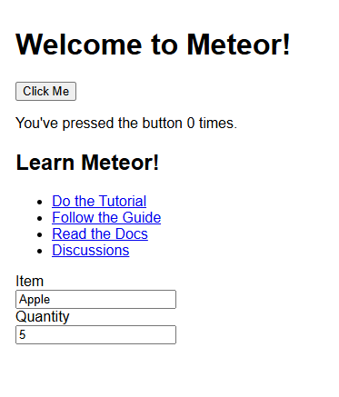
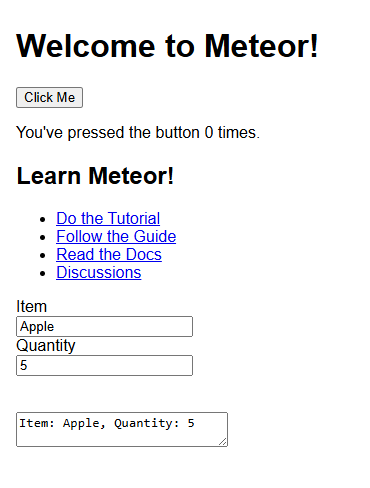
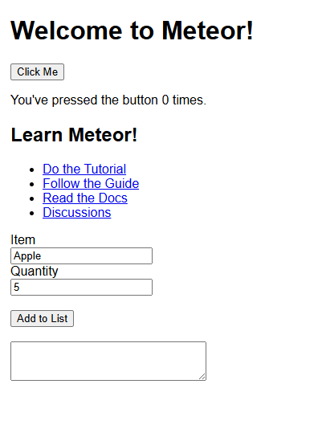
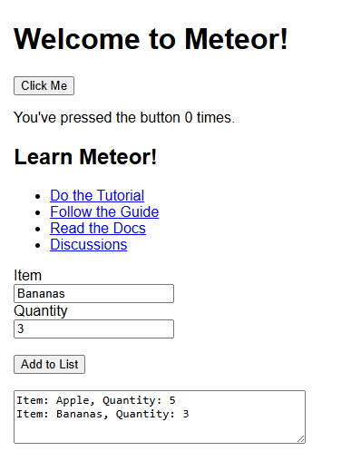
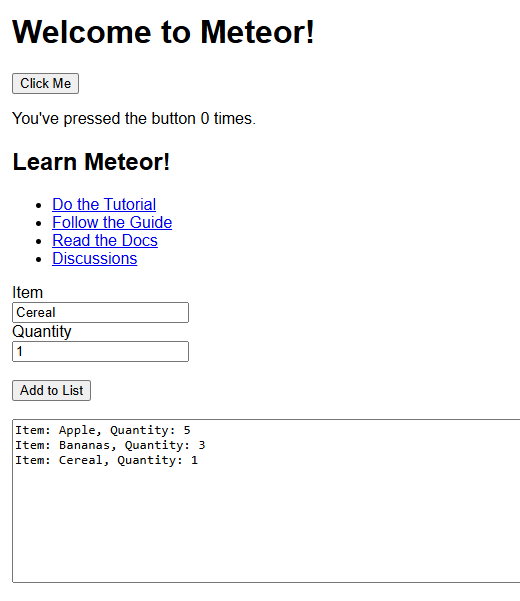

# Technology Tutorial Plan
**Prepared by Max Craig**

# Links to additional information
### Meteor.JS
- [Installing meteor.js](https://v2-docs.meteor.com/install.html)
- [Introduction to meteor.js](https://guide.meteor.com/)
- [Creating an app](https://react-tutorial.meteor.com/simple-todos/01-creating-app.html)

### React
- [React Quick Start](https://react.dev/learn)
- [Introduction to React in Meteor.js](https://guide.meteor.com/react)
### MongoDB
- [Mongosh installation guide](https://www.mongodb.com/docs/mongodb-shell/install/)
- [What is MongoDB](https://www.mongodb.com/company/what-is-mongodb)
- [MongoDB in Meteor](https://guide.meteor.com/collections.html)

# Preface
This Technology Tutorial Plan will follow the creation of a small application that teaches
- Setting up a meteor.js application
- Using react to create components
- Basic typescript/Library usage to interact with React components
- MongoDB usage to store persistant data

Each tutorial will build upon what was done previously, so they should be completed in order


### The Application

For this tutorial, we’re going to setup a basic shopping list application, it will have an interface with the following features
- Input fields to enter item and quantity
- Button to submit item to shopping list
- Field to view all items currently in the shopping list
- Items in the shopping list will be stored in a MongoDB database

<br></br>
<br></br>

# 1. Installing Meteor.js
To install meteor.js, you can follow the steps outlined [here](https://docs.meteor.com/about/install).

In general, whether you are using windows or not, you should run the following command
```
npx meteor
```

If this does not work, try running the following command instead
```
npm install -g meteor --foreground-script
```

If neither work, please consult the link above.
<br></br>
<br></br>

# 2. Setting up a Meteor.js application

## Creating a Meteor.js application

> Information has been gather from this meteor tutorial: [creating the app](https://react-tutorial.meteor.com/simple-todos/01-creating-app.html)

Begin by choosing a directory where you would to create your meteor application, and then running the following command
```
meteor create shopping-list-app --prototype --typescript --tailwind
```
> NOTE: [--prototype](https://docs.meteor.com/cli/#prototype) is an argument to allow changing of collections quickly, and should not be used on an actual production ready application, please omit when doing actual projects

The `--typescript` and `--tailwind` arguments specify the framework components we will be using and automatically configures meteor code for us to handle that.

<br></br>

When finished, the following directories and files should be create


## Running the meteor.js application

To run our newly creating shopping list application, run the following commands

```bash
cd shopping-list-app
meteor run
```
Expect to see the following output
```
C:\Git Repos\2025W1-HansRoslinger\shopping-list-app>meteor run
[[[[[ C:\Git Repos\2025W1-HansRoslinger\shopping-list-app ]]]]]

=> Started proxy.
=> Started HMR server.
=> Started MongoDB.
=> Linted your app. No linting errors.
I20250325-18:30:30.354(11)? ** You've set up some data subscriptions with Meteor.publish(), but
I20250325-18:30:30.501(11)? ** you still have autopublish turned on. Because autopublish is still
I20250325-18:30:30.501(11)? ** on, your Meteor.publish() calls won't have much effect. All data        
I20250325-18:30:30.502(11)? ** will still be sent to all clients.
I20250325-18:30:30.503(11)? **
I20250325-18:30:30.503(11)? ** Turn off autopublish by removing the autopublish package:
I20250325-18:30:30.504(11)? **
I20250325-18:30:30.505(11)? **   $ meteor remove autopublish
I20250325-18:30:30.505(11)? **
I20250325-18:30:30.506(11)? ** .. and make sure you have Meteor.publish() and Meteor.subscribe() calls 
I20250325-18:30:30.507(11)? ** for each collection that you want clients to see.
I20250325-18:30:30.508(11)?
=> Started your app.

=> App running at: http://localhost:3000/
   Type Control-C twice to stop.
```
*This should create a local hosted server at `http://localhost:3000/` where you can access your application*
> NOTE: as you change your **client side code** the web server will change **LIVE**, this makes development very easy as the modifications are instantly seen. However, if you modify any server side code you may need to close this terminal and rerun it to refresh.

> ANOTHER NOTE: the terminal where you run your meteor app has to stay open for the live server to be accessible, create another terminal to do other commands


*This is what the webpage should look like*

# 3. Using React in meteor.js?

> If you haven't already, install react into your meteor application
```
meteor npm install --save react react-dom
```

In the case of meteor.js, React UI Components are stored in the `imports/ui` directory.

```
├───api
│       links.ts
└───ui
        App.tsx
        Hello.tsx
        Info.tsx
```

Each individual part of the UI is written in a `.tsx` react file, and they are all imported and combined together in the `App.tsx` file

```tsx
// App.tsx
import React from 'react';
import { Hello } from './Hello.tsx'; //Importing the Hello component from Hello.tsx
import { Info } from './Info.tsx'; //Importing the Info component from Info.tsx

export const App = () => (
  <div>
    <h1>Welcome to Meteor!</h1> //Here we can define html code
    <Hello/>  // We can also add imported components so they are included in the application
    <Info/>
  </div>
);
```

> EXERCISE: take a look at the `Hello.tsx` and `Info.tsx` files and see how the components are being defined

---

<br></br>
## How is the App.tsx then ran by the client?

in the `client` directory there contains 3 files. This is the top level html file which is ran accessible by the client from the localhost webpage
- It's html!

```
├───client
    main.css
    main.html
    main.tsx
```

<br></br>

The `main.html` file creates a div (a block) in html which references an object with the id `react-target`.
```html
<head> <<>>
  <title>shopping-list-app</title>
  <meta name="viewport" content="width=device-width, initial-scale=1.0">
</head>

<body>
  <div id="react-target"></div>   <!-- A div is created that specifies the react-target component -->
</body>

```

the `main.tsx` imports the `App` as a react components, creates a component with the react-target that is specified, and tells the container to render the react code from the App component.
```tsx
// main.tsx
import React from 'react';
import { createRoot } from 'react-dom/client';
import { Meteor } from 'meteor/meteor';
import { App } from '/imports/ui/App'; //Here the main App component is imported

Meteor.startup(() => {
  const container = document.getElementById('react-target');
  const root = createRoot(container);
  root.render(<App />);
});
```

<br></br>
<br></br>


# 4. Creating Shopping list React Components 
Now that we know the structure of react components in meteor.js, let's try and create two UI components.
- A set of Input fields where we can add items to our shopping list
- A text box where we can see all the items in our shopping list
<br></br>
> NOTE: the key to react components is to create ones that are as **reusable as possible**. This is the heart of React and what allows you to simplify web application code a lot.

To follow this principle, lets create 2 new directories `Input` and `Output`, and a file in each. `inputField.tsx` and `textBox.tsx`.

Creating directories for groups of components is a good way to keep everythign organised

The directory layout should look like this
```
└───ui
    │   App.tsx
    │   Hello.tsx
    │   Info.tsx
    │
    ├───Input
    │       index.tsx
    │       InputField.tsx
    │
    └───Output
            index.tsx
            TextBox.tsx
```
You can also see we have created 2 `index.tsx` files, I'll talk about them later on

## InputField.tsx
In this file we are going to create a reusable component for defining an input field
```tsx
// Input/InputField.tsx
import React from 'react';

export const InputField: React.FC<{ label: string; value: string; onChange: (e: React.ChangeEvent<HTMLInputElement>) => void }> = ({ label, value, onChange }) => {
  return (
    <div>
      <label>{label}</label>
      <br />
      <input type='text' value={value} onChange={onChange} />
    </div>
  );
};
```
The react component to create an inputField has 3 inputs: `label`, `value` and `onChange`

> label: This is the text that is put before the input field to indicate what its for

> value: This defines a variable that you can read from in your typescript code

> onChange: This is a function you input which performs some action when text is written


## index.tsx and simplifying component imports
Remember that index.tsx file above? The reason we include that is so that we can simplify the imports of components in directories.

**Without index.tsx** if we wanted to import the `InputField.tsx` from `App.tsx` we would have to use the following code

```tsx
// App.tsx
import { InputField } from './Input/InputField.tsx';
```
This looks fine, but as we add more and more files, we would have to have a newline for each file in that one directory!
```tsx
// App.tsx
import { InputField } from './Input/InputField';
import { Button } from './Input/Button';
import { Calendar } from './Input/Calendar';
... This sucks!
```

<br></br>
Instead we can define a `index.tsx` file which exports every component in the directory under a single import

```tsx
// Input/index.tsx
export { InputField } from './InputField';
export { Button} from './Button' // These would be potential future components
export { Calendar} from './Calendar' // These would be potential future components
```
<br></br>
This way we can simplify our import to the following, making it easier for everyone!

```tsx
// App.tsx
import {InputField, Button, Calendar} from './Input';
```

wow!
<br></br>
From all these learnings, lets add this new InputField to our `App.tsx`

```tsx
// App.tsx
import React, { useState } from 'react';
import { Hello } from './Hello';
import { Info } from './Info';
import { InputField } from './Input';

export const App: React.FC = () => {
  const [item, setItem] = useState<string>('Apple'); //useState is a very common react function that defines a variable 'item' and a function 'setitem' that is used to modify that item
  const [quantity, setQuantity] = useState<string>('5'); //Here we set the default value of the quantity to "5"

  const handleItemChange = (e: React.ChangeEvent<HTMLInputElement>) => setItem(e.target.value); //here we have defined a function which will update the value of the item variable when we enter anything into it's InputField
  const handleQuantityChange = (e: React.ChangeEvent<HTMLInputElement>) => setQuantity(e.target.value);

  return (
    <div>
      <h1>Welcome to Meteor!</h1>
      <Hello />
      <Info />

      {/* Input for item */}
      <InputField
        label="Item"
        value={item} //The value of the item is displayed to the text box
        onChange={handleItemChange} //When you type into the text box, the value is updated
      />

      {/* Input for quantity */}
      <InputField
        label="Quantity"
        value={quantity}
        onChange={handleQuantityChange}
      />
    </div>
  );
};

```
You can see above that we define React components in our returned div as if they were HTML components, and we define attributes to customise these InputFields.

In order to handle the values that we get from the InputField, we use a common react function called UseState

```tsx
import React, { useState } from 'react';
const [<variable>, <function>] = useState(<defaultValue>)
```

<br></br>
Above is the default template for how useState is defined, and it sets out a variable, it's default value, as well as a function which can be used to interact with it.

In our application here, we've defined functions `setItem` and `setQuantity` which is used to update the value of the variables when anything is typed into the input fields.
<br></br>
<br></br>
If you've done it correctly your webpage should look something like this


<br></br>
<br></br>

## TextBox.tsx

Now that we have an InputField component, lets set up a basic TextBox field

```tsx
// Output/TextBox.tsx
import React from 'react';

export const TextBox: React.FC<{ value: string }> = ({ value }) => {
  return (
    <div>
      <textarea value={value} readOnly />
    </div>
  );
};

```
The inputs are the following:
> value: what we would like to display to the text box

`readOnly` makes it so nothing can be entered by the client on the website

Lets also define our `index.tsx` file to make importing easier
```tsx
// Output/index.tsx
export { TextBox } from './TextBox';
```

<br></br>
<br></br>


Once this is done, lets add this to our `App.tsx`
```tsx
// App.tsx
import React, { useState } from 'react';
import { Hello } from './Hello.tsx';
import { Info } from './Info.tsx';
import { InputField } from './Input';
import { TextBox } from './Output'; // Importing TextBox component to display output

export const App = () => {
  const [item, setItem] = useState('Apple'); // useState is a very common react function that defines a variable 'item' and a function 'setItem' that is used to modify that item
  const [quantity, setQuantity] = useState('5');

  const handleItemChange = (e) => setItem(e.target.value); // Here we have defined a function which will update the value of the item variable when we enter anything into its InputField
  const handleQuantityChange = (e) => setQuantity(e.target.value);

  return (
    <div>
      <h1>Welcome to Meteor!</h1>
      <Hello />
      <Info />

      {/* Input for item */}
      <InputField
        label="Item"
        type="text"
        value={item} // The value of the item is displayed to the text box
        onChange={handleItemChange} // When you type into the text box, the value is updated
      />

      {/* Input for quantity */}
      <InputField
        label="Quantity"
        type="number"
        value={quantity}
        onChange={handleQuantityChange}
      />

      <br></br>
      <br></br>

      {/* Display the current item and quantity using TextBox */}
      <TextBox value={`Item: ${item}, Quantity: ${quantity}`} /> 
    </div> // TextBox will display the current values
  );
};

```
We can see at the bottom I've defined a TextBox component that's value is the current Item and Quantity we have written into the text box
- This is not the intended final design but it just demonstrates the use of variables and the value in the TextBox component

<br></br>

With everything finally in your webpage it should look like this!



We can see that as we type values into our input fields, it automatically gets added to our text box below!

<br></br>
<br></br>
# 4. Writing javascript and interacting with React Components

Currently the Item and Quantity we enter into the input fields is shown also in the textBox. But now let's try and allow users to add multiple items to this list.

For this we'll need 2 things
- A Button component to toggle some code
- Some code to add the values to a list

## Button Component
Again, like our InputField, we're going to define a generic Button Input that we can use inside our `Input` directory

```tsx
// Input/Button.tsx
import React from 'react';

// Button component that takes 'label' and 'onClick' as props
export function Button({ label, onClick }) {
  return (
    <button onClick={onClick}>{label}</button>
  );
}
```
This button component takes 2 inputs
> label: the text you want to display on the button

> onClick: a function which does something when the button is clicked

As well, don't forget to add this new component to our index.tsx

```tsx
// Input/index.tsx
export { InputField } from './InputField';
export { Button} from './Button';
```

<br></br>
<br></br>
## Adding this Button to our app and having it do something
Now that we have our button component, let's add it to our App

```tsx
// App.tsx
import { InputField, Button } from './Input'; //update the Input import to include new button

//...
//...
<Button
label="Add to List"
onClick={addToList}
/>
```

You can see above, we've defined a function called `addToList` inside the `onClick`. This is a new function we have to define that will take a list, and add the values from the 2 input fields to it.

Here is an example of logic to do just that
```tsx
// App.tsx
const [shoppingList, setShoppingList] = useState([]); //we've define a list that can we set the value of
const addToList = () => { //this function updates the shopping list above by appending a new value to it
setShoppingList((prevList) => [...prevList, `Item: ${item}, Quantity: ${quantity}`]);
}
```

<br></br>
finally, we'll need to update the `TextBox` to display what is stored in our shopping list, instead of just what was in the input fields

```tsx
// App.tsx
{/* Display the current items and quantity in the shopping list */}
<TextBox value={shoppingList.join("\n")} /> 
```

<br></br>
<br></br>

With all that said and done, our final `App.tsx` should look like the following

```tsx
// App.tsx
import React, { useState } from 'react';
import { Hello } from './Hello';
import { Info } from './Info';
import { InputField, Button } from './Input';
import { TextBox } from './Output'; // Importing TextBox component to display output

export const App: React.FC = () => {
  const [item, setItem] = useState<string>('Apple'); //useState is a very common react function that defines a variable 'item' and a function 'setitem' that is used to modify that item
  const [quantity, setQuantity] = useState<string>('5'); //Here we set the default value of the quantity to "5"

  const handleItemChange = (e: React.ChangeEvent<HTMLInputElement>) => setItem(e.target.value); //here we have defined a function which will update the value of the item variable when we enter anything into it's InputField
  const handleQuantityChange = (e: React.ChangeEvent<HTMLInputElement>) => setQuantity(e.target.value);

  const [shoppingList, setShoppingList] = useState<string[]>([]); // We've defined a list that can hold strings
  const addToList = () => { // This function updates the shopping list above by appending a new value to it
    setShoppingList((prevList) => [...prevList, `Item: ${item}, Quantity: ${quantity}`]);
  };
  return (
    <div>
      <h1>Welcome to Meteor!</h1>
      <Hello />
      <Info />

      {/* Input for item */}
      <InputField
        label="Item"
        value={item} //The value of the item is displayed to the text box
        onChange={handleItemChange} //When you type into the text box, the value is updated
      />

      {/* Input for quantity */}
      <InputField
        label="Quantity"
        value={quantity}
        onChange={handleQuantityChange}
      />

      <br></br>
      <br></br>

      <Button
        label="Add to List"
        onClick={addToList}
      />

      {/* Display the current item and quantity using TextBox */}
      <TextBox value={shoppingList.join("\n")} /> 
    </div>
  );
};
```

<br></br>


We can also see that if we type vlaues into the input fields and press `Add to list`, they will show up in the TextBox below



HOW COOL!
> NOTE: you may find that if you refresh the page, the values stored in the textBox will dissapear, this is because the list is created and only kept for each instance of the website, and gets reset when you refresh the page and the client is recreated. If you want to keep persistant data, you'll need a `MongoDB Database`, which is what the next section will cover.

As well, incase you are lost, the current file `ui` directory structure should look like this

```
└───ui
    │   App.tsx
    │   Hello.tsx
    │   Info.tsx
    │
    ├───Input
    │       Button.tsx
    │       index.tsx
    │       InputField.tsx
    │
    └───Output
            index.tsx
            TextBox.tsx
```
# 5. Using MongoDB

MongoDB is a unstructured (noSQL) database that stores data in JSON-like documents, as opposed to relational tables like other databases. Each document can vary in data, containing different fields, types and values

The main data collection method in mongoDB is a `Collection`

A collection is a grouping of MongoDB documents. These documents don't neccessarily need to have the same schema, but the convention is they should as it makes it easier to query and utilise.

## Downloading MongoDB
In order to use MongoDB effectively you'll need to do the following

#### Download MongoDB Shell
MongoDB Shell is a terminal app that lets you interact with the database easily, and is used by meteor.

Download it from here https://www.mongodb.com/try/download/compass
- For Windows users, make sure to select `MSI` as the package

### Running MongoDB alongside your meteor application
A local MongoDB Database is automatically created alongside your application when you run `meteor run`, however if you would like to easily view, add and delete values from it, you should create another terminal (alongside the current terminal where the meteor app is running) and run `meteor mongo`

```bash
PS C:\Git Repos\2025W1-HansRoslinger\shopping-list-app> meteor mongo
Current Mongosh Log ID: 67e32cb649bbde488cb71235
Connecting to:          mongodb://127.0.0.1:3001/meteor?directConnection=true&serverSelectionTimeoutMS=2000&appName=mongosh+2.4.2
Using MongoDB:          7.0.5
Using Mongosh:          2.4.2

meteor [direct: primary] meteor>
```
This will give you a terminal interface where you can interact with your DB

We'll show some commands later once setup our shopping list in MongoDBD

- include mongosh msi
- meteor npm install simpl-schema
- meteor add aldeed:collection2

- meteor run
- meteor mongo in another terminal

if you make any modifications to server code you'll need to rerun meteor run (or maybe meteor refresh?)

## Setting Up Our Shopping List In MongoDB

### imports/api/shoppinglist.ts
in the API directory in our application, we're going to create a new typescript file which will be used to create a ShoppingList Collection in our MongoDB

```javascript
import { Mongo } from 'meteor/mongo';

// Define the ShoppingList MongoDB collection
export const ShoppingListCollection = new Mongo.Collection<{ item: string; quantity: string }>('shoppingList');

// Function to add the current item and quantity to MongoDB
export const AddToList = (item: string, quantity: string): void => {
  const doc = { item, quantity: quantity };
  ShoppingListCollection.insert(doc); // Insert the new item into the collection
};
```
Here we've defined a new ShoppingList Collection for our MongoDB, and we've defined a mutating function which will allow you to add a new item/quantity pair to the DB

### server/main.ts
To ensure the database is persistent across clients, we need to publish the ShoppingList collection on the `server side` inside the `server/main.js` file

```javascript
  import { ShoppingListCollection } from '/imports/api/shoppinglist';
  ...
  ...
  // We publish the entire Links collection to all clients.
  // In order to be fetched in real-time to the clients
  Meteor.publish("links", function () {
    return LinksCollection.find();
  });
  Meteor.publish('shoppingList', function publishShoppingList() {
    return ShoppingListCollection.find();
  });
```
At the very bottom similar to how the links collection is defined, we are publishing the ShoppingList collection to our database when the server is spun up for the first time.

### Updating App.tsx

With the database section setup, we can now use it in our App.tsx

At the top we have to import 3 new packages

> PLEASE RUN `npm install @types/meteor --save-dev`

```tsx
import { ShoppingListCollection, AddToList } from '../api/shoppinglist';
import { useTracker } from 'meteor/react-meteor-data';
import { Meteor } from 'meteor/meteor';
```


Our ShoppingListCollection, AddToList function, and a UseTracker

UseTracker is a React hook that will automatic run specified code when any data is modified, in this case our MongoDB Database. This is is used to update the TextField when we add a new document.

```tsx
  const [shoppingList, setShoppingList] = useState<{ item: string; quantity: string }[]>([]);  // We've defined a list that can hold strings
  
  useTracker(() => {
    Meteor.subscribe('shoppingList'); // Subscribe to the shopping list data
    const items = ShoppingListCollection.find().fetch(); // Fetch the shopping list items
    setShoppingList(items); // Update the shopping list state
  }, []);
```
The useTracker subscribes to the ShoppingList, and will update the values in our local shopping list (the one shown to the textfield) when any values change


And finally, we update our Button and our TextField
```tsx
      <Button
        label="Add to List"
        onClick={() => AddToList(item, quantity)}
      />
      <br></br>
      <br></br>

      {/* Display the current items and quantity in the shopping list */}
      <TextBox value={shoppingList.map(entry => `Item: ${entry.item}, Quantity: ${entry.quantity}`).join('\n')} />
```
We update our button so when we click it, it will use the ShoppingList API to add the item and quantity to the database

We then have to update our textBox to take our local shoppingList array, which stores a list of all the objects in our database, and map it so it prints it out in a nice format


The final solution should look like this
```tsx
import React, { useState } from 'react';
import { Hello } from './Hello';
import { Info } from './Info';
import { InputField, Button } from './Input';
import { TextBox } from './Output'; // Importing TextBox component to display output
import { ShoppingListCollection, AddToList } from '../api/shoppinglist';
import { useTracker } from 'meteor/react-meteor-data';
import { Meteor } from 'meteor/meteor';

export const App: React.FC = () => {
  const [item, setItem] = useState<string>('Apple'); //useState is a very common react function that defines a variable 'item' and a function 'setitem' that is used to modify that item
  const [quantity, setQuantity] = useState<string>('5'); //Here we set the default value of the quantity to "5"

  const handleItemChange = (e: React.ChangeEvent<HTMLInputElement>) => setItem(e.target.value); //here we have defined a function which will update the value of the item variable when we enter anything into it's InputField
  const handleQuantityChange = (e: React.ChangeEvent<HTMLInputElement>) => setQuantity(e.target.value);

  const [shoppingList, setShoppingList] = useState<{ item: string; quantity: string }[]>([]);  // We've defined a list that can hold strings
  
  useTracker(() => {
    Meteor.subscribe('shoppingList'); // Subscribe to the shopping list data
    const items = ShoppingListCollection.find().fetch(); // Fetch the shopping list items
    setShoppingList(items); // Update the shopping list state
  }, []);

  return (
    <div>
      <h1>Welcome to Meteor!</h1>
      <Hello />
      <Info />

      {/* Input for item */}
      <InputField
        label="Item"
        value={item} //The value of the item is displayed to the text box
        onChange={handleItemChange} //When you type into the text box, the value is updated
      />

      {/* Input for quantity */}
      <InputField
        label="Quantity"
        value={quantity}
        onChange={handleQuantityChange}
      />

      <br></br>
      <br></br>

      <Button
        label="Add to List"
        onClick={() => AddToList(item, quantity)}
      />
      <br></br>
      <br></br>

      {/* Display the current items and quantity in the shopping list */}
      <TextBox value={shoppingList.map(entry => `Item: ${entry.item}, Quantity: ${entry.quantity}`).join('\n')} />
    </div>
  );
};
```

### Running our App

We can see that when running the app we can successfully add items to the shopping list, and when refreshing the webpage they still stay there

<br></br>



If use the terminal where we ran `meteor mongo`, we can run the following commands to get some info about our collections

```shell
meteor [direct: primary] meteor> show collections
links
shoppingList
meteor [direct: primary] meteor> db.shoppingList.find().pretty()
[
  { _id: 'sxsYTm4ZjiMZWHjZZ', item: 'Apple', quantity: 5 },
  { _id: '7RzCKrvzfyBcWycNS', item: 'Bananas', quantity: 3 },
  { _id: 'PLBkvtS54RDsgXnMq', item: 'Cereal', quantity: 1 }
]
meteor [direct: primary] meteor> db.shoppingList.drop()
true
```
Running the last command lets us remove all the items from our shopping list.

# Conclusion

If you've gotten through this entire tutorial congrats! You've successfully been able to create a small shopping list application that has utilised meteor.js reuseable react components, typescript and MongoDB!

Pretty cool right?
